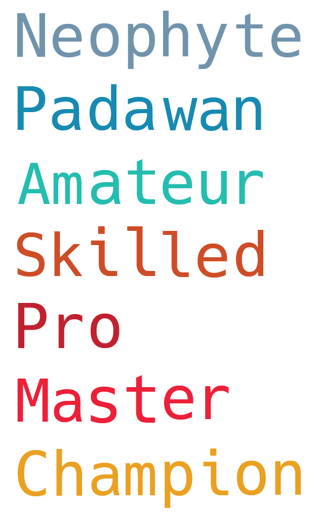
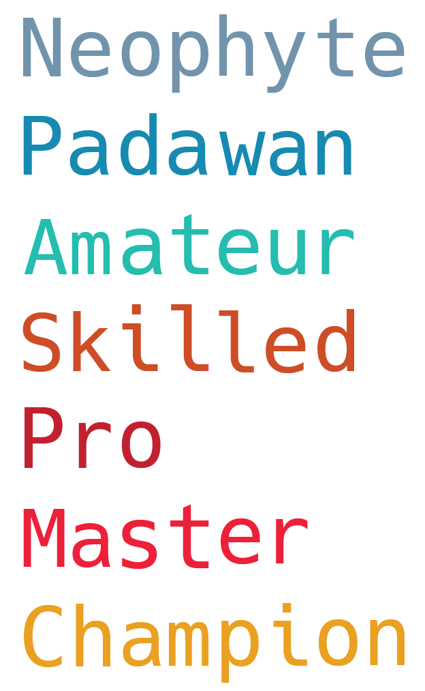

<h1 align="center"> This folder contains resources for our ranks. </h1>

Resources: 

- <a href="/emojis/">/emojis/</a>, a folder with 25 emojis, made to be used in discord

- <a href="/emojis/lunaroranks-dark.png">lunaroranks.png / lunaroranks-dark.png</a>,  two images that showcase how our ranks are displayed.
  
    
    

- <a href="https://coolors.co/7594a9-1489b1-38a3a5-cd4b13-c0212e-f71735-e89f22">Our ranks' color pallete</a>